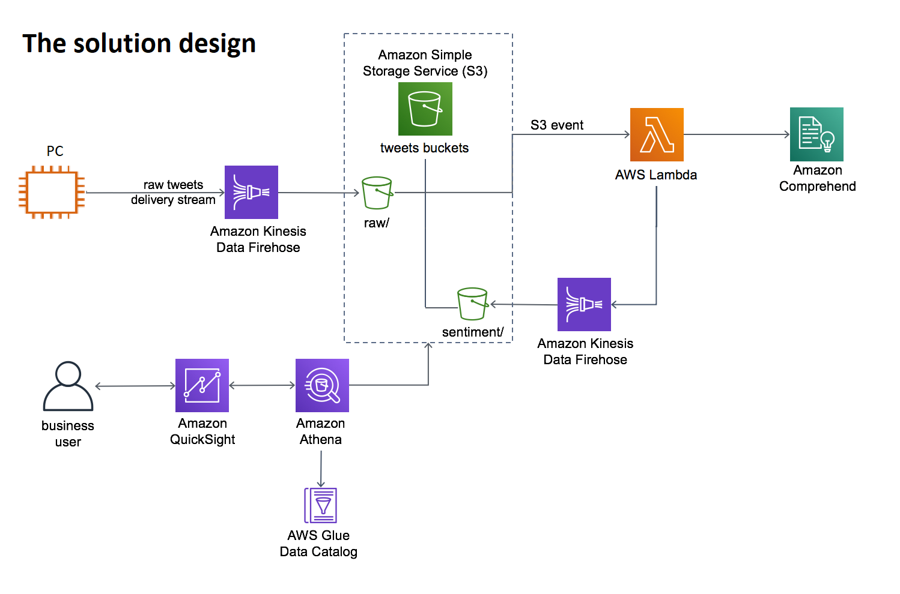
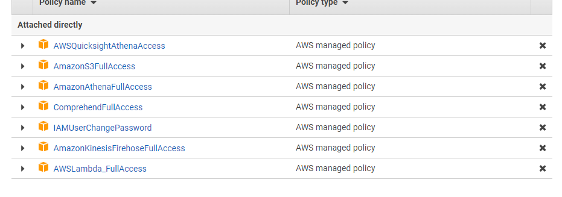
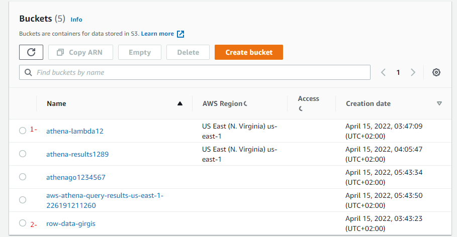
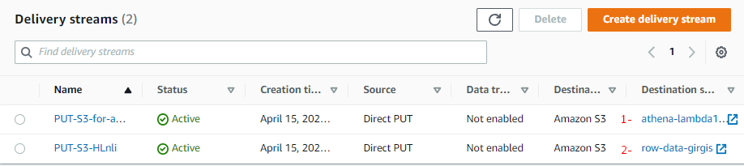
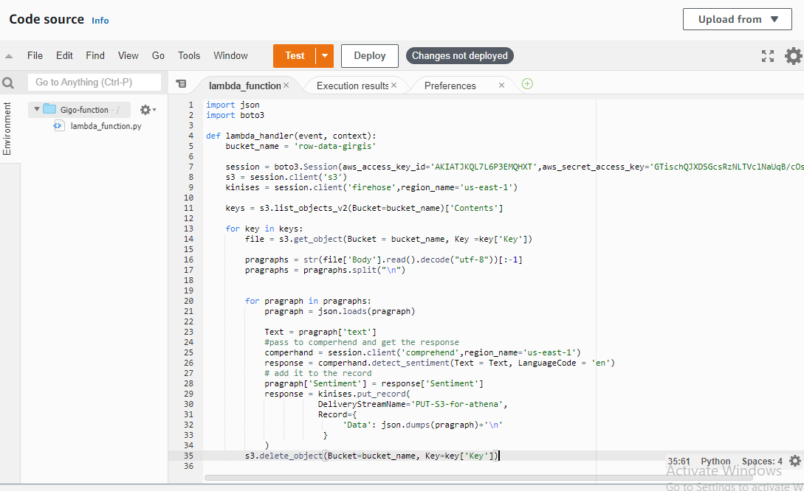
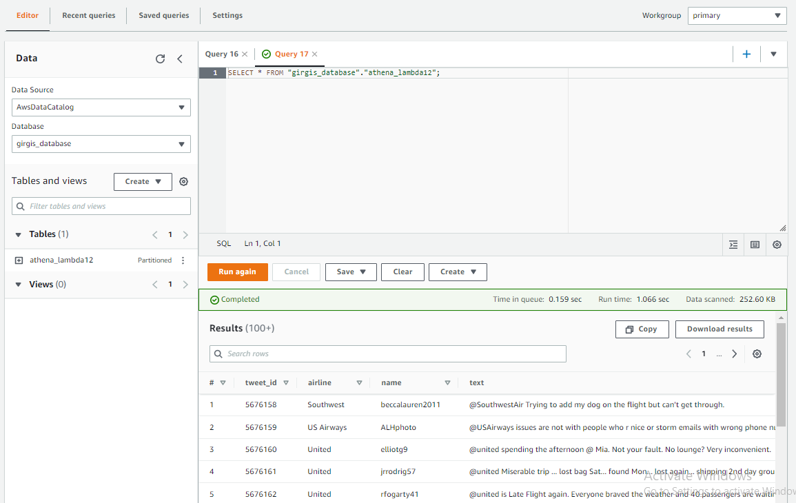
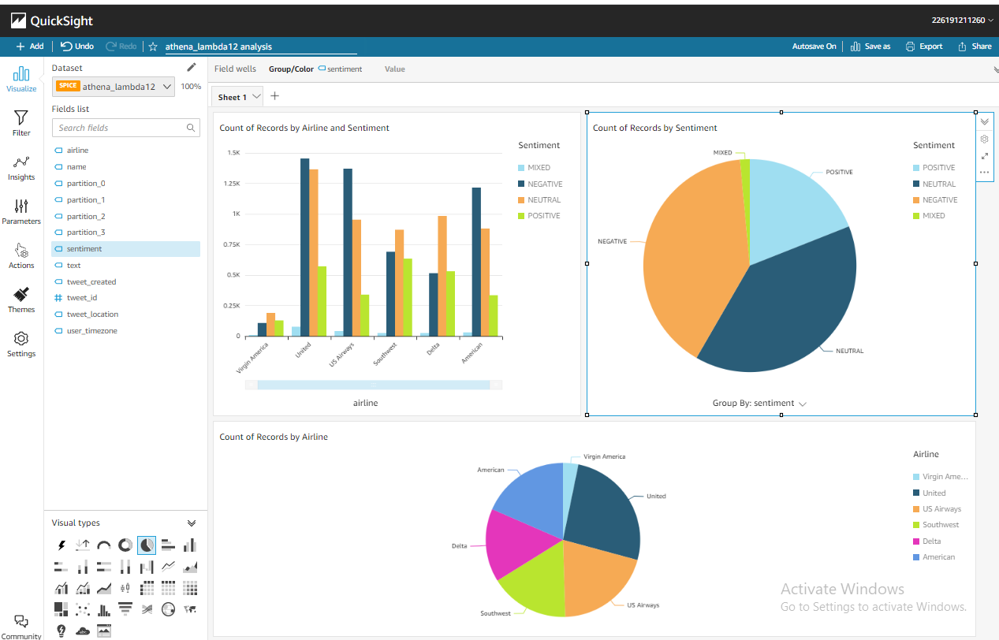

# AI-Driven-Social-Media-Dashboard
[My-Step-By-Step-Video-Record](https://drive.google.com/drive/folders/1POylvI2S2wWIMmW39OjwuVwUsVDhuXYl?usp=sharing)

# The architecture


# The solution implementation:

**Make a user and give him the polices needed**


**Make three S3 buckets (one for the row data, and one of the analyzed data)**


**Make Two kinesis firehose streams link one with the row data and one with analyzed data
bucket as shown**


**Download the tweets.json and build Jupiter notebook to send the stream to the firehose to
AWS**
```Python
import json
import boto3
import time
session =
boto3.Session(aws_access_key_id='',aws_secret_access_key='')
temperatureClient = session.client('firehose',region_name='us-east-1')
with open('tweets.json','r',encoding='utf-8') as json_file:
    observations = json.loads(json_file.read())
    for observation in range(50,500):
    # I removed the tweet_coord because crawler can't understand its structure
        del observations[observation]['tweet_coord']
        print(observations[observation])
        if observation % 20 == 0:
            time.sleep(1)
        print(observations[observation])
        response = temperatureClient.put_record(
            DeliveryStreamName='PUT-S3-HLnli',
            Record={
            'Data': json.dumps(observations[observation])+'\n'
            }
        )
    print(response)
```

**Make lambda function with trigger on the put request in the row S3 bucket, the lambda
function call comprehend and take the result and put it using the second kinesis firehose stream
to put the result in Athena S3 for visualization**



**To use Athena I used crawlers to define the schema first and insert the table to athena as
shown**



**Finally, used quick sight for building the dashboard**

